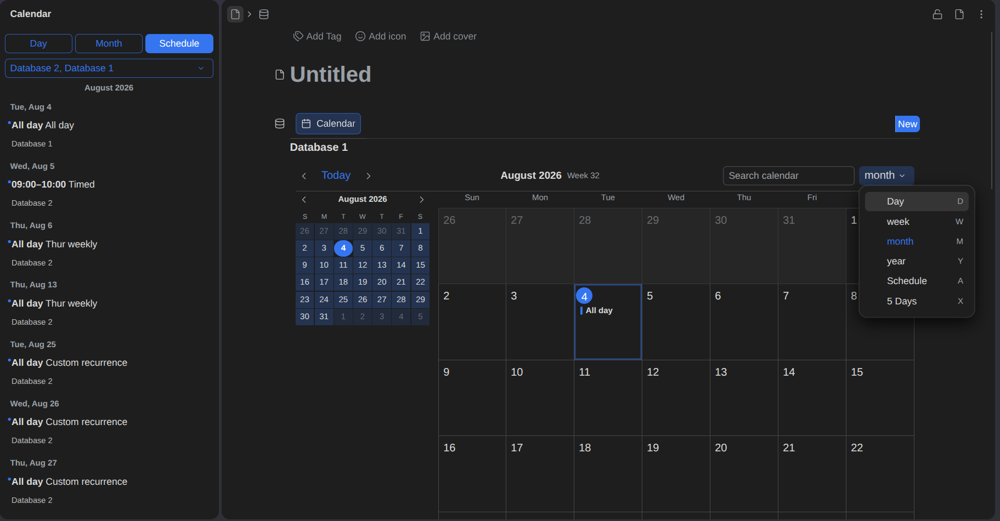

# SiYuan with Attribute View Calendar

A fork of [SiYuan](https://github.com/siyuan-note/siyuan) that adds a calendar to the Attribute View. The calendar lives inside an Attribute View block and offers month, week, multi-day, day and agenda layouts, with all-day and timed events, recurrence, drag and resize, search and filter, keyboard navigation, mobile touch, a Calendar dock, ICS import and 21 locales.



## Design

Attribute View rows and properties remain the source of truth. The calendar reads and writes the same rows through the Attribute View transaction API, and no separate calendar database is created. Closing and reopening the block renders the same events from the same rows.

## Features

- Month, week, multi-day, day and agenda views
- All-day and timed events
- Recurring events
- Drag and resize
- Search and filter
- Keyboard navigation
- Mobile touch support
- Calendar dock for a persistent schedule view
- ICS import
- 21 locales

## How to try

The calendar work lives on the `feat/av-calendar` branch and is also merged into `master` here. Run it from source:

```bash
git clone https://github.com/eloklam/siyuan-database-calendar.git
cd siyuan
git checkout feat/av-calendar

# terminal 1: build and start the kernel
cd kernel
go build -tags "fts5 sqlcipher" -o ../app/kernel/SiYuan-Kernel .
cd ..
./app/kernel/SiYuan-Kernel serve --mode dev --port 6806 --workspace /path/to/a-test-workspace

# terminal 2: build the UI and start Electron
cd app
pnpm run dev:desktop
pnpm start
```

Use a test workspace, never your real notes. `pnpm start` in development mode connects to the kernel on port 6806 instead of spawning its own.

## Status

The calendar was built mainly through AI-assisted vibe coding. Quality and compatibility with upstream cannot be guaranteed, and there is no promise of maintenance or restructuring. It exists because a calendar inside the Attribute View was wanted; the upstream feature request that started it is [siyuan-note/siyuan#13740](https://github.com/siyuan-note/siyuan/issues/13740).

License: AGPL-3.0, same as upstream.

## 中文简介

这是 SiYuan 的一个 fork，在属性视图（Attribute View）中加入日历视图：月、周、多日、日、议程五种布局，支持全天与定时事件、重复事件、拖拽调整、搜索过滤、键盘操作、移动端触摸、日历停靠面板、ICS 导入和 21 种语言。核心设计是属性视图的行和属性仍然是唯一数据源，日历不创建独立数据库。

试用：检出 `feat/av-calendar` 分支，按上方英文说明从源码启动内核和前端，先构建内核，再运行 `pnpm run dev:desktop` 和 `pnpm start`。测试时请使用测试工作空间，不要使用真实笔记库。

注意：日历主要靠 AI 辅助编程完成，质量与上游兼容性无法保证，也不承诺后续维护。上游功能请求见 https://github.com/siyuan-note/siyuan/issues/13740 ，上游仓库见 https://github.com/siyuan-note/siyuan 。
